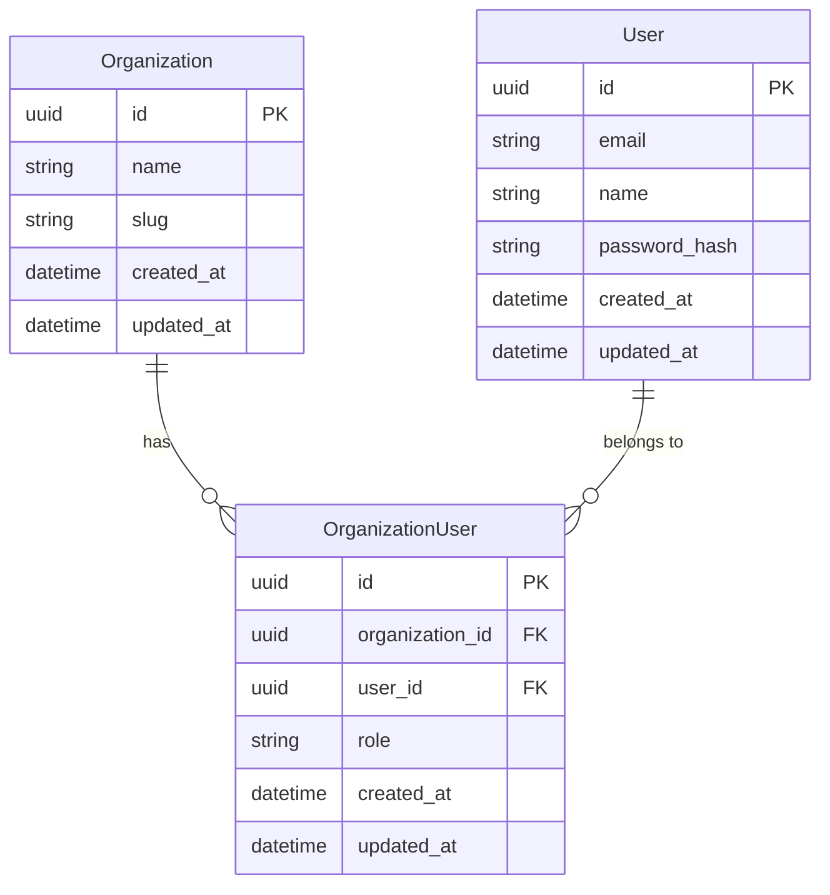

# 🗄️ DATABASE.md

## 1. SaaS Multi-Tenancy Strategy

To support multiple organizations/tenants on a single instance:

- **Organization Isolation:** Every core table contains an `organization_id`.
- **Global Filters:** All `sqlc` queries must include `WHERE organization_id = $1` to prevent data leakage between different organizations.

---

## 2. Core Entities & Schema

### Organizations (The SaaS Root)

| Column | Type        | Description                         |
| ------ | ----------- | ----------------------------------- |
| `id`   | `UUID (PK)` | Unique ID for the Organization.     |
| `name` | `VARCHAR`   | Official name of the entity.        |
| `slug` | `VARCHAR`   | URL-friendly identifier.            |

### Users (Administrative Staff)

| Column | Type        | Description                         |
| ------ | ----------- | ----------------------------------- |
| `id`   | `UUID (PK)` | Unique ID for the User.             |
| `email`| `VARCHAR`   | User email (Unique).                |
| `name` | `VARCHAR`   | User full name.                     |

### Organization Users (Junction / Membership)

| Column | Type        | Description                                      |
| ------ | ----------- | ------------------------------------------------ |
| `id`   | `UUID (PK)` | Unique ID for the membership.                    |
| `organization_id`| `UUID (FK)` | Reference to the Organization. |
| `user_id`| `UUID (FK)` | Reference to the User.                         |
| `role` | `VARCHAR`   | Role within the organization (e.g., ADMIN, MEMBER).|

### ER Diagram

